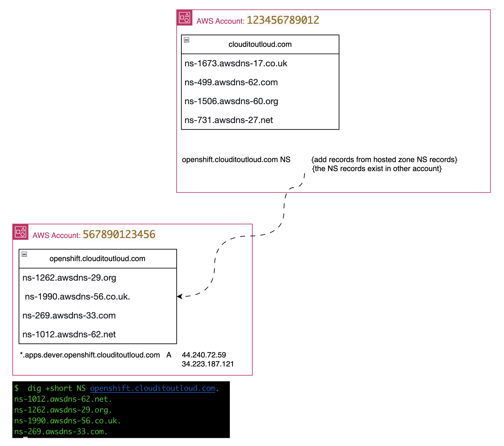

# route53_multi_account_delegation
An example of how to delegate DNS management across accounts

## Status
This is a work in progress.  
I'll be adding some images and more explanation, but this should get the point across to someone who has already been in this situation.

## Issue
I plan to test some different methods to deploy containers.  (Red Hat OpenShift Container Platform, AWS EKS, Roll my own using Graviton).  

### Issue 1
OpenShift has some installation dependencies that can be challenging to mitigate (especially if you're just beginning) - namely, the installer wants to manage DNS entries for the cluster your are building 

*  api.(OCP_CLUSTER_NAME).(OCP_DOMAIN_NAME) 
*  *.apps.(OCP_CLUSTER_NAME).(OCP_DOMAIN_NAME)

### Issue 2
I want to keep track of the "billing aspect" of each of these initiatives.  Having separate accounts make that much easier.  Also, with separate accounts, I can burn down one entire environment (OpenShift, for example)  and KNOW that I will not impact the other environments (EKS)

###  Issue 3
My personal account owns my Second Level Domain (clouditoutloud.com), but I will be using my work account(s) to test OpenShift, EKS, etc...
This particular situation is similar to what an enterprise customer might run in to with different teams having their own AWS accounts (as they should).

### Hypothetical "Business Example"
Let's say your organization owns a domain, in this case: clouditoutloud.com.  This domain was registered via AWS and is managed in that same AWS account.  
After some time, the "OCP Developer team" asks the "CORP IT team" for the ability to manage their own frequent DNS updates from their own AWS account - in this particular case, to test OpenShift Container Platform.  
Then, another team wants to test AWS EKS, you'll repeat the process using the "EKS Developer team" account

## Visualization


## Steps (high-level)
* Register domain (clouditoutloud.com)
* Create a Hosted Zone (public) for clouditoutloud.com in "CORP IT account"
* Create a Hosted Zone (public) for openshift.clouditoutloud.com in "OCP Developer account"
  *  Note the NS records to provide to the CORP IT team
* Create Record in the CORP IT account:
  *  Record Name:  "openshift.clouditoutloud.com"
  *  Record Type:  NS
  *  Value(s):  4 x NS servers selected when you created the "openshift.clouditoutloud.com" Hosted Zone in the OCP Developer account

To create an OpenShift 4 Cluster using this new domain, use the following values (in your install-config.yaml):
```
export OCP_BASE_DOMAIN=openshift.clouditoutloud.com
export OCP_CLUSTER_NAME=dever
```

Update your `install-config.yaml`
  * baseDomain: $OCP_BASE_DOMAIN
  * metadata:name: $OCP_CLUSTER_NAME

## Testing
Notice that the second-level domain and both of the third-level domains have different NS records
```
$ dig +short NS clouditoutloud.com
ns-731.awsdns-27.net.
ns-1673.awsdns-17.co.uk.
ns-1506.awsdns-60.org.
ns-499.awsdns-62.com.

$ dig +short NS openshift.clouditoutloud.com
ns-1012.awsdns-62.net.
ns-1262.awsdns-29.org.
ns-1990.awsdns-56.co.uk.
ns-269.awsdns-33.com.

$ dig +short *.apps.dever.openshift.clouditoutloud.com
44.240.72.59
34.223.187.121

$ dig +short NS doeks.clouditoutloud.com
ns-1442.awsdns-52.org.
ns-1942.awsdns-50.co.uk.
ns-494.awsdns-61.com.
ns-559.awsdns-05.net.
```

## Discussion Points
* why not just use [Resource Access Manager (RAM)](https://aws.amazon.com/ram/) to share DNS management between accounts?

## References

